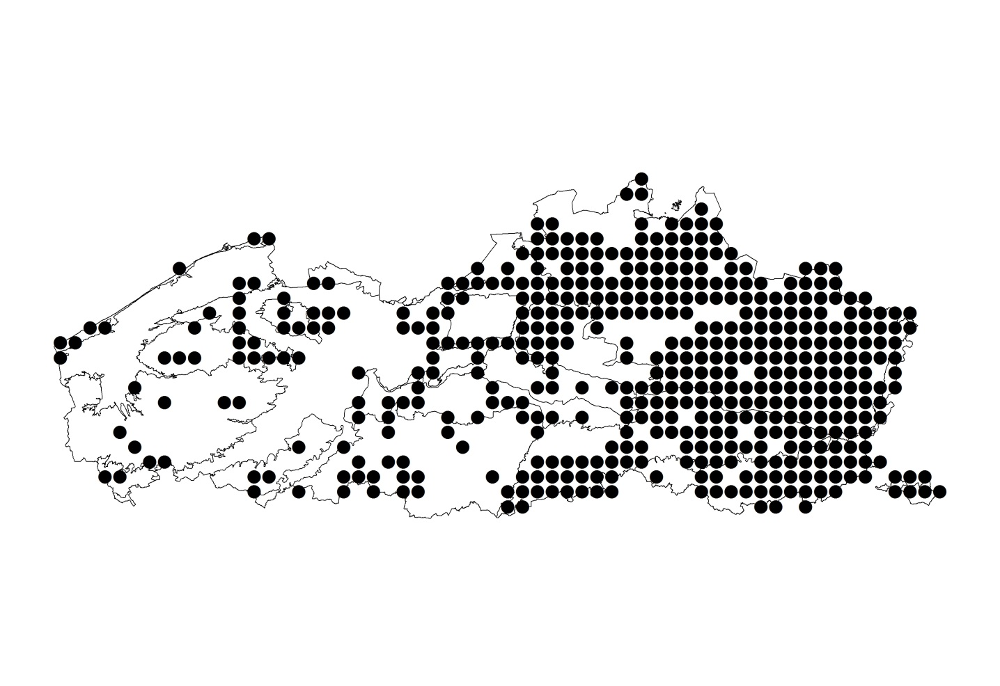

```{r setup, include=FALSE}
library(knitr)
opts_chunk$set(
  echo = FALSE,
  dpi = 72,
  dev = "png",
  out.width = "100%")

#library(RODBC)
library(ggplot2)
#library(nlme)
#library(mgcv)
#library(lme4)
library(MASS)
#library(splines)
#library(stats)
library(vegan)
library(readxl)
library(rprojroot)
library(DHARMa)
library(tidyverse)
library(janitor)
library(inborutils)
library(inbodb) #remotes::install_github("inbo/inbodb", build_vignettes = TRUE)
source(find_root_file("src/functions.R",
                      criterion = is_git_root))
library(brms)
library(patchwork)

```

```{r}

con <- connect_inbo_dbase("D0021_00_userFlora")
mosdata <- get_florabank_taxon_ifbl_year_2(
  connection = con,
  starting_year = 1980, 
  ifbl_resolution = "4km-by-4km", 
  taxongroup = "Mossen", 
  collect = TRUE
)


ellenberg <- get_florabank_traits(
  connection = con, 
  trait_name = "Ellenb", 
  collect = TRUE)

substraat <- get_florabank_traits_2(con, 
                     trait_name = "Substraat klassen mossen", 
                     collect = TRUE) %>%
  filter(extra_omschrijving == "3")


taxa <- tbl(src = con, "tblTaxon")
rel_groep <- tbl(src = con, "relTaxonTaxonGroep")
taxongroep <- tbl(src = con, "tblTaxonGroep")

taxa <- taxa %>%
  inner_join(rel_groep %>%
               select(-ID),
             by = c("ID" = "TaxonID")) %>%
  inner_join(taxongroep %>%
               filter(Naam %in% c("Mossen")
                      ) %>%
               select(-Code),
             by =  c("TaxonGroepID" = "ID")
             ) %>%
  collect()


dbDisconnect(con)
rm(con)
```


```{r}
mosdata <- mosdata %>%
  inner_join(taxa %>%
               select(ID, taxongroep = Naam), 
             by = c("TaxonIDParent" = "ID"))
```

```{r}
ellenberg <- ellenberg %>%
  inner_join(mosdata %>%
               distinct(TaxonIDParent),
             by = c("TaxonID" = "TaxonIDParent"))
```


```{r}
mosdata <- mosdata %>%
  clean_names()
ellenberg <- ellenberg %>%
  clean_names()
taxa <- taxa %>%
  clean_names()
```

```{r eval=!file.exists(find_root_file("data/taxa_gbif.csv", criterion = is_git_root))}
taxa_gbif <- taxa %>%
  select(id, code, naam_nederlands, naam_wetenschappelijk,
         taxn_vrs_key, taxongroep = naam) %>%
  gbif_species_name_match(name = "naam_wetenschappelijk")
write_tsv(x = taxa_gbif, 
          path = find_root_file("data/taxa_gbif.csv", criterion = is_git_root))
```

```{r eval=file.exists(find_root_file("data/taxa_gbif.csv", criterion = is_git_root))}
taxa_gbif <- read_tsv(file = find_root_file("data/taxa_gbif.csv", criterion = is_git_root))
```


```{r}
geobserveerde_taxa <- taxa_gbif %>%
  semi_join(mosdata %>%
               distinct(taxon_id_parent),
             by = c("id" = "taxon_id_parent"))
```

```{r}
mosdata <- mosdata %>%
  left_join(geobserveerde_taxa %>%
              select(id, phylum),
            by = c("taxon_id_parent" = "id"))
```

```{r}
vertaling_substraat <- read_csv2(
  find_root_file(
    "data/substraat_mossen.csv",
    criterion = is_git_root)
  )
```

# Exploratory data analysis
## General

- Anthocerotophyta = hornworth = hauwmossen
- Bryophyta = bryophytes = bladmossen
- Marchantiophyta = liverworths = levermossen

```{r}
mosdata %>%
  group_by(phylum) %>%
  summarize(n_obs = n(),
            n_soorten = n_distinct(taxon_id_parent),
            n_hokken = n_distinct(ifbl_4by4)) %>%
  kable()
```


```{r}
mosdata %>%
  count(ifbl_4by4, jaar, name = "number of species") %>%
  ggplot() + 
  geom_density(aes(x = `number of species`, 
                     colour = factor(jaar))) + 
  ylab("density of ifbl 4 km x 4 km squares")
```

```{r}
mosdata %>%
  ggplot() + 
  geom_bar(aes(x = jaar, fill = phylum))
```


```{r}
species_freqs <- mosdata %>%
  filter(phylum != "Anthocerotophyta",
         !is.na(phylum)) %>%
  group_by(phylum) %>%
  mutate(n = n()) %>%
  group_by(phylum, taxon_id_parent) %>%
  summarise(
    n_obs = n(),
    prop_n_obs = n_obs/n[1],
    n_jaren = n_distinct(jaar),
    n_hokken = n_distinct(ifbl_4by4))
```


```{r}
species_freqs %>%
  ggplot() +
  geom_histogram(aes(x = prop_n_obs)) + 
  ylab("number of species") +
  facet_wrap(~phylum, scales = "free", ncol = 2)
```


```{r}
species_freqs %>%
  ggplot() +
  geom_histogram(aes(x = n_obs)) + 
  ylab("number of species") +
  facet_wrap(~phylum, scales = "free", ncol = 2)
```


```{r}
beginjaar <- 1980
cesuurjaar <- 2000
eindjaar <- 2019
analyse_data <- mosdata %>%
  filter(between(jaar, beginjaar, eindjaar)) %>%
  filter(phylum %in% c("Bryophyta", "Marchantiophyta")) %>%
  mutate(periode = ifelse(between(jaar, beginjaar, cesuurjaar - 1),
                          paste(beginjaar, cesuurjaar - 1, sep = "-"), 
                          paste(cesuurjaar, eindjaar, sep = "-")))
```

```{r}
analyse_data %>%
  count(ifbl_4by4, periode, name = "number of species") %>%
  ggplot() + 
  geom_density(aes(x = `number of species`, 
                     colour = periode)) + 
  ylab("density of ifbl 4 km x 4 km squares") +
  geom_vline(xintercept = 40)
```


```{r}
analyse_data_telfer <- analyse_data %>%
  distinct(ifbl_4by4, taxon_id_parent, periode, phylum) %>%
  mutate(value = 1) %>%
  pivot_wider(id_cols = c(ifbl_4by4, taxon_id_parent, phylum),
              names_from = periode, 
              values_from = value, 
              values_fill = list(value = 0)) %>%
  group_by(ifbl_4by4) %>%
  filter(sum(`2000-2019`) >= 40,
         sum(`1980-1999`) >= 40) %>%
  ungroup() %>%
  pivot_longer(cols = c(`2000-2019`, `1980-1999`), 
               names_to = "periode", 
               values_to = "values") %>%
  filter(values == 1) %>%
  select(-values)

```

```{r}
analyse_data_telfer_agg <- analyse_data_telfer %>%
  group_by(periode) %>%
  mutate(n_hok_tot = n_distinct(ifbl_4by4)) %>%
  count(periode, phylum, taxon_id_parent, n_hok_tot, 
        name = "n_hok") %>%
  ungroup() 
```


```{r}
analyse_data_telfer_agg <- analyse_data_telfer_agg %>%
  pivot_wider(id_cols = c(phylum, taxon_id_parent), 
              names_from = periode,
              values_from = c(n_hok, n_hok_tot), 
              values_fill = list(n_hok = 0)) %>%
  janitor::clean_names() %>%
  mutate(n_hok_tot_2000_2019 = ifelse(is.na(n_hok_tot_2000_2019),
                                        max(n_hok_tot_2000_2019,
                                            na.rm = TRUE),
                                        n_hok_tot_2000_2019),
         n_hok_tot_1980_1999 = ifelse(is.na(n_hok_tot_1980_1999),
                                        max(n_hok_tot_1980_1999,
                                            na.rm = TRUE),
                                        n_hok_tot_1980_1999),
         prop_baseline = (n_hok_1980_1999 + 0.5) / (n_hok_tot_1980_1999 + 1),
         prop_2000_2019 = (n_hok_2000_2019 + 0.5) / (n_hok_tot_2000_2019 + 1)
         )
```


```{r}
# adding explanatory variables
ellenb_wide <- ellenberg %>%
  pivot_wider(id_cols = c(taxon_id), 
              names_from = kenmerk, 
              values_from = rekenwaarde) %>%
  select(taxon_id, 
         ell_l = `Ellenberg Licht`,
         ell_n = `Ellenberg Stikstof`,
         ell_f = `Ellenberg Vocht`,
         ell_r = `Ellenberg Reactiegetal`
         , ell_t = `Ellenberg Temperatuur`
         )


analyse_data_telfer_agg <- analyse_data_telfer_agg %>%
  left_join(ellenb_wide, 
            by = c("taxon_id_parent" = "taxon_id")) %>%
  # warning! species can have more than one substrate -> Wouter already selected 
  # most important one, but this should be coded in the script?
  # need to downweight species with more than one substrate in analyses
  left_join(substraat %>% 
              clean_names() %>%
              select(taxon_id, substraat = omschrijving) %>%
              inner_join(vertaling_substraat, 
                         ) %>%
              select(-substraat) %>%
              group_by(taxon_id) %>%
              #weights to be used in analyses
              mutate(wei = 1/n()) %>%
              ungroup(),
            by = c("taxon_id_parent" = "taxon_id")
            )
```

## Ellenberg

```{r}
analyse_data_telfer_agg %>%
  filter(complete.cases(analyse_data_telfer_agg)) %>%
  select(phylum, ell_l, taxon_id_parent) %>%
  distinct() %>%
  count(phylum, ell_l, name = "number of species") %>%
  kable()
```

```{r}
analyse_data_telfer_agg %>%
  filter(complete.cases(analyse_data_telfer_agg)) %>%
  select(phylum, ell_r, taxon_id_parent) %>%
  distinct() %>%
  count(phylum, ell_r, name = "number of species") %>%
  kable()
```


```{r}
analyse_data_telfer_agg %>%
  filter(complete.cases(analyse_data_telfer_agg)) %>%
  select(phylum, ell_f, taxon_id_parent) %>%
  distinct() %>%
  count(phylum, ell_f, name = "number of species") %>%
  kable()
```


```{r}
analyse_data_telfer_agg %>%
  filter(complete.cases(analyse_data_telfer_agg)) %>%
  select(phylum, ell_n, taxon_id_parent) %>%
  distinct() %>%
  count(phylum, ell_n, name = "number of species") %>%
  kable()
```


```{r}
analyse_data_telfer_agg %>%
  filter(complete.cases(analyse_data_telfer_agg)) %>%
  select(phylum, ell_t, taxon_id_parent) %>%
  distinct() %>%
  count(phylum, ell_t, name = "number of species") %>%
  kable()
```


```{r}
analyse_data_telfer_agg %>%
  ungroup() %>%
  filter(phylum == "Bryophyta") %>%
  select(taxon_id_parent, starts_with("ell")) %>%
  distinct() %>%
  select(starts_with("ell")) %>%
  GGally::ggpairs(title = "Bryophyta")
```

```{r}
analyse_data_telfer_agg %>%
  ungroup() %>%
  filter(phylum != "Bryophyta") %>%
  select(taxon_id_parent, starts_with("ell")) %>%
  distinct() %>%
  select(starts_with("ell")) %>%
  GGally::ggpairs(title = "Marchantiophyta") 
```

## Substrate

Only remove substrate levels with less than 5 species (for Ellenberg variables this is not necessary because they are included as continuous covariate).

```{r}
analyse_data_telfer_agg <- analyse_data_telfer_agg %>%
  filter(complete.cases(analyse_data_telfer_agg)) %>%
  group_by(phylum, substrate) %>%
  filter(n() > 5) %>%
  ungroup()
```

```{r}
analyse_data_telfer_agg %>%
  filter(complete.cases(analyse_data_telfer_agg)) %>%
  select(phylum, substrate, taxon_id_parent) %>%
  distinct() %>%
  count(phylum, substrate, name = "number of species") %>%
  kable()
```


```{r}
analyse_data_telfer_agg %>% 
  ggplot() + 
  geom_bar(aes(x = substrate, fill = phylum), 
           position = position_dodge(width = 1)) + 
  coord_flip()
```


```{r}
analyse_data_telfer_agg %>%
  count(phylum, taxon_id_parent) %>%
  count(phylum, n, name = "Number of species associated with n substrates") %>%
  kable()
```

## Persisting, lost, gained species

(ref:persisting-lost-gained) Number of species gained, lost or persisting per phylum without taking into account difference in recording activity or uncertainty in the data. Thus, numbers are based on raw data. 

```{r persisting-lost-gained}
analyse_data_telfer_agg %>%
  select(-substrate) %>%
  distinct() %>%
  mutate(trajectory = case_when(
    n_hok_1980_1999 == 0 & n_hok_2000_2019 > 0 ~ "gained",
    n_hok_1980_1999 > 0 & n_hok_2000_2019 == 0 ~ "lost",
    n_hok_1980_1999 > 0 & n_hok_2000_2019 > 0 &
      n_hok_2000_2019 < n_hok_1980_1999 ~ "persisting, decreased",
    n_hok_1980_1999 > 0 & n_hok_2000_2019 > 0 &
      n_hok_2000_2019 > n_hok_1980_1999 ~ "persisting, increased",
    n_hok_1980_1999 > 0 & n_hok_2000_2019 > 0 &
      n_hok_2000_2019 == n_hok_1980_1999 ~ "persisting, stable"
  )) %>%
  count(phylum, trajectory, name = "Number of species") %>%
  kable(caption = "(ref:persisting-lost-gained)")

```


## Period 1 vs period 2

```{r plotlyfig, out.width="100%", out.height="5in"}
p <- analyse_data_telfer_agg %>%
  left_join(taxa_gbif %>%
              select(id, naam_wetenschappelijk),
            by = c("taxon_id_parent" = "id")) %>%
  select(-substrate) %>%
  distinct() %>%
  ggplot() +
  geom_jitter(aes(x = prop_baseline,
                  y = prop_2000_2019,
                  text = naam_wetenschappelijk)) +
  geom_abline() +
  geom_smooth(aes(x = prop_baseline,
                  y = prop_2000_2019),
              method = "lm") +
  facet_wrap(~phylum) 

p %>% plotly::ggplotly()
```

```{r plotlyfiglogit, out.width="100%", out.height="5in"}
p <- analyse_data_telfer_agg %>%
  left_join(taxa_gbif %>%
              select(id, naam_wetenschappelijk),
            by = c("taxon_id_parent" = "id")) %>%
  select(-substrate) %>%
  distinct() %>%
  ggplot() +
  geom_jitter(aes(x = qlogis(prop_baseline),
                  y = qlogis(prop_2000_2019),
                  text = naam_wetenschappelijk)) +
  geom_abline() +
  geom_smooth(aes(x = qlogis(prop_baseline),
                  y = qlogis(prop_2000_2019)),
              method = "lm") +
  facet_wrap(~phylum) 

p %>% plotly::ggplotly()
```


```{r}
analyse_data_telfer_agg %>%
  select(phylum, taxon_id_parent, n_hok_1980_1999, n_hok_2000_2019) %>%
  distinct() %>%
  pivot_longer(cols = starts_with("n_hok")) %>%
  mutate(value_binned = cut_number(value, n = 5)) %>%
  count(phylum, name, value_binned) %>%
  kable()
```


# Methods

## Trends

To assess the changes in distribution of bryophyte species form 1980 until 2019 we divided the survey in two periods and compared the period 1980-1999 with the period 2000-2019. 
To minimize the effect of badly prospected grid cells we only used grid cells (16km²) where at least 40 species were found in both periods (Figure \@ref(fig:fig1)).

(ref:fig1) 16 km² grids of Flanders and the Brussels Capital Region with at least 40 species of Bryophytes recorded in both the period 1980-1999 and the period 2000-2019.

```{r fig1, out.width = "100%", fig.cap = "(ref:fig1)"}

```


This resulted in 227 grid cells prospected in both periods.
In these selected grid cells 35648 bryophyte observations (expressed as unique species per year and per 1 km² grid) were done in the first period and 45236 in the second period.
To correct for potential changes in survey effort within those grids the number of occupied grid cells in the second period was modeled as a function of the number of occupied grid cells in the first period so that effects of other explanatory variables could be interpreted relative to the change in survey effort.
The conceptual idea comes from @telfer2002, but the technical implementation that we followed is different from the original proposal.

The method assumes that during the two surveys recorders attempted to observe as many species as possible in each grid cell.
The surveyors in both periods looked for liverworths and mosses and we therefor did not consider survey effort to differ between both phyla. 
The size of the distribution area of individual species in a given period, i.e., the number of 16 km² grid cells where the species was observed, was expressed as a proportion of the total number of grid cells studied during that period.
To summarise the changes in distribution area for all species, we modeled the number of occupied 16 km² squares in the second survey (out of the total number of 16 km² squares considered, i.e. proportional data) as a function of the logit-transformed proportion in the first survey (baseline) and covariates (phylum, substrate and Ellenberg values for light, moisture, nitrogen and temperature).
Substrate effects (11 levels) were modeled for each phylum separately as random effects coming from a normal distribution with mean zero and an estimated standard deviation.
A species could be associated with more than substrate type.
If that was the case, a weighting factor (one divided by the number of substrate types) was used to ensure that each species in a given period has equal weight in the analysis (if this is not done, confidence interval would be too narrow and estimates could be biased).
Because the counts were overdispersed (variance larger than Binomial distribution), a beta-binomial distribution was used to account for overdispersion and a logit-link was used to link the proportions to the linear predictor with the following model equation:


$$
g(\mu_{i,s2}) = \beta_0 + \beta_1\log\frac{\mu_{i,s1}}{1-\mu_{i,s1}} + (\beta_L\text{ell}_L + \beta_F\text{ell}_F + \beta_N\text{ell}_N + \beta_T\text{ell}_T)\text{phylum}_k + \mathbf{b}_{o,j} + \mathbf{b}_{1,j}\text{phylum}_k
$$
where:

$$
\begin{aligned}
\mu_{i,s2} \equiv \mathbf{E}(Y_{i,s2}|\text{trials, weights},\mathbf{b})&& \text{expected value}\\
g(\mu_{i,s2}) = \log\frac{\mu_{i,s2}}{1-\mu_{i,s2}} && \text{logit-link} \\
Y_{i,s2} \sim \text{BetaBinomial}(\mu_{i,s2}, \phi_{i,s2}) && \text{Beta-Binomial distribution}\\
\begin{bmatrix}\mathbf{b}_{o,j}\\ \mathbf{b}_{1,j}\end{bmatrix}\sim N(0,\Sigma) && \text{random intercept and slope}\\
\Sigma = \begin{bmatrix}\sigma^2_{0,j}&0\\0&\sigma^2_{1,j}\end{bmatrix} && \text{variance-covariance matrix}
\end{aligned}
$$


All species were included also those that occurred in less than five 16 km² grid cells in the first period.
In @telfer2002, these species were removed, but our model diagnostics showed that they could be included.
To avoid calculating the log of zero, the proportion of occupied grid cells in the first period, $\mu_{i,s1}$ was calculated as $(n_{i, s1}+0.5)/(n_{\text{tot}}+1)$.
This transformation is not necessary for the response variable because the beta-binomial accommodates zeroes.

A Bayesian hierarchical modeling procedure was used to calculate the posterior distribution for these parameters [@burkner2017] and we assumed non-informative priors.

We focused model selection on the Ellenberg terms only. 
All other effects were kept in the model.
First, interaction terms for Ellenberg-values with phylum for which the 95% confidence interval contained 0 were removed.
Next, main Ellenberg terms for which the 95% confidence interval contained 0 were removed.
The simplest model with the highest predictive accuracy based on leave-one-out cross validation [@vehtari2017] was selected.

The Ellenberg terms are in principle ordinal values.
In an exploratory phase, we modeled these terms as monotonic effects [@burkner2020], but the results reassured us that we could treat the Ellenberg values as continuous values.


All analyses were done using the R language for statistical computing [@rcoreteam2020].

```{r betabinom}
beta_binomial2 <- custom_family(
  "beta_binomial2", dpars = c("mu", "phi"),
  links = c("logit", "log"), lb = c(NA, 0),
  type = "int", vars = "vint1[n]"
)
# T = number of trials
# mu = a / (a + b) = per trial probability
# phi = a + b = overdispersion parameter
stan_funs <- "
  real beta_binomial2_lpmf(int y, real mu, real phi, int T) {
    return beta_binomial_lpmf(y | T, mu * phi, (1 - mu) * phi);
  }
  int beta_binomial2_rng(real mu, real phi, int T) {
    return beta_binomial_rng(T, mu * phi, (1 - mu) * phi);
  }
"
stanvars <- stanvar(scode = stan_funs, block = "functions")
```


```{r format-data-analysis}

analyse_data_long_weights <-  analyse_data_telfer_agg %>%
  pivot_longer(cols = c(n_hok_1980_1999, n_hok_2000_2019), 
               names_to = "periode",
               names_prefix = "n_hok_",
               values_to = "n_hok") %>%
  select(-n_hok_tot_1980_1999, -starts_with("prop")) %>%
  rename(n_hok_tot = n_hok_tot_2000_2019) %>%
  relocate(periode, n_hok, .before = n_hok_tot) 
  

```


```{r full-model}
# assuming change in recording effort is not different for phylums
# thus no main effect for phylum and no interaction of phylum with baseline period
# interactions of continuous covariates with phylum without main effect of phylum is possible
options(contrasts = c('contr.sum', 'contr.poly'))
alt_telfer <- brm(n_hok_2000_2019 | vint(n_hok_tot_2000_2019) + weights(wei) ~ 
                    qlogis((n_hok_1980_1999+0.5)/(n_hok_tot_1980_1999+1))
                  + ell_l
                  + ell_n
                  + ell_f
                  + ell_t
                  + ell_l:phylum
                  + ell_n:phylum
                  + ell_f:phylum
                  + ell_t:phylum
                  + (1 + phylum || substrate)
                  , 
                  family = beta_binomial2,
                  stanvars = stanvars,
                  data = analyse_data_telfer_agg,
                  file = "stanmodel_alt_telfer",
                  file_refit = "on_change",
                  save_pars = save_pars(all = TRUE),
                  silent = 2,
                  cores = 4)
```


```{r}
expose_functions(alt_telfer, vectorize = TRUE)

log_lik_beta_binomial2 <- function(i, prep) {
  mu <- prep$dpars$mu[, i]
  phi <- prep$dpars$phi
  trials <- prep$data$vint1[i]
  y <- prep$data$Y[i]
  beta_binomial2_lpmf(y, mu, phi, trials)
}

posterior_predict_beta_binomial2 <- function(i, prep, ...) {
  mu <- prep$dpars$mu[, i]
  phi <- prep$dpars$phi
  trials <- prep$data$vint1[i]
  beta_binomial2_rng(mu, phi, trials)
}

posterior_epred_beta_binomial2 <- function(prep) {
  mu <- prep$dpars$mu
  trials <- prep$data$vint1
  trials <- matrix(trials, nrow = nrow(mu), ncol = ncol(mu), byrow = TRUE)
  mu * trials
}
```

```{r create-conditions}
create_conditions <- function(x, vars, ...) {
    vars <- rev(as.character(vars))
    if (!is.data.frame(x) && "data" %in% names(x)) {
        x <- x$data
    }
    x <- as.data.frame(x)
    out <- brms:::named_list(vars)
    for (v in vars) {
        tmp <- get(v, x)
        if (brms:::is_like_factor(tmp)) {
            tmp <- levels(as.factor(tmp))
        }
        else {
            tmp <- mean(tmp, na.rm = TRUE)
        }
        out[[v]] <- tmp
    }
    out <- rev(expand.grid(out))
    #out$n_hok_tot_2000_2019 <- 1
    out$cond__ <- rows2labels(out, ...)
    out
}
```


```{r full-model-long-format, eval=FALSE}
m_full <- brm(n_hok | vint(n_hok_tot) + weights(wei) ~ 
                phylum
              + periode
              + ell_l
              + ell_n
              + ell_f
              + ell_t
              + ell_l:periode
              + ell_n:periode
              + ell_f:periode
              + ell_t:periode
              + ell_l:phylum
              + ell_n:phylum
              + ell_f:phylum
              + ell_t:phylum
              + ell_l:phylum:periode
              + ell_n:phylum:periode
              + ell_f:phylum:periode
              + ell_t:phylum:periode
              + (1 + phylum + periode + phylum:periode || substrate)
              + (1 | taxon_id_parent)
                  , 
    family = beta_binomial2,
    stanvars = stanvars,
    data = analyse_data_long_weights,
    file = "stanmodel_m_full",
    file_refit = "on_change",
    save_pars = save_pars(all = TRUE),
    silent = 2,
    cores = 4)

```

```{r test-m-full-predictions, eval=FALSE}

conditional_effects(m_full, "ell_l:periode", 
                    conditions = make_conditions(m_full, "phylum"))

conditional_effects(m_full, "ell_n:periode", 
                    conditions = make_conditions(m_full, "phylum"))

conditional_effects(m_full, "ell_f:periode", 
                    conditions = make_conditions(m_full, "phylum"))

conditional_effects(m_full, "ell_t:periode", 
                    conditions = make_conditions(m_full, "phylum"))

# posterior predictions period 1 and 2
# period 1 / period 2

nd_1 <- create_conditions(m_full,
                        vars = c("ell_n", "ell_f", "ell_t")) %>%
  select(-cond__) %>%
  mutate(phylum = "Bryophyta",
         periode = "1980_1999",
         taxon_id_parent = NA,
         substrate = NA,
         n_hok_tot = 228 ) %>%
  expand_grid(ell_l = c(1:9))

nd_2 <- create_conditions(m_full,
                        vars = c("ell_n", "ell_f", "ell_t")) %>%
  select(-cond__) %>%
  mutate(phylum = "Bryophyta",
         periode = "2000_2019",
         taxon_id_parent = NA,
         substrate = NA,
         n_hok_tot = 228 ) %>%
  expand_grid(ell_l = c(1:9))

nd <- bind_rows(nd_1, nd_2)

pep_1 <- posterior_linpred(m_full, newdata = nd, re_formula = NULL)
nd %>% 
  bind_cols(as_tibble(t(pep_1))) %>% pivot_longer(starts_with("V")) %>%
  pivot_wider(id_cols = NULL, names_from = periode, values_from = value) %>%
  mutate(diff = `2000_2019` - `1980_1999`) %>%
  group_by(ell_l) %>%
  summarise(mean_cl_boot(exp(diff))) 

```


# Results


## Model selection

```{r model-selection, message=FALSE, warning=FALSE}
alt_telfer_2a <- update(
  alt_telfer, 
  .~.
  - ell_t:phylum
  - ell_l:phylum
  , file = "stanmodel_alt_telfer_2a"
  , file_refit = "on_change"
  , save_pars = save_pars(all = TRUE)
  , cores = 4)


alt_telfer_2b <- update(alt_telfer_2a, 
                       .~. 
                       - ell_t
                       - ell_l
                      , file = "stanmodel_alt_telfer_2b"
                      , file_refit = "on_change"
                      , save_pars = save_pars(all = TRUE)
                      , cores = 4)


alt_telfer <- add_criterion(alt_telfer, "loo", 
                            moment_match = FALSE, 
                            overwrite = FALSE)

alt_telfer_2a <- add_criterion(alt_telfer_2a, "loo", 
                            moment_match = FALSE,
                            overwrite = FALSE)

alt_telfer_2b <- add_criterion(alt_telfer_2b, "loo", 
                            moment_match = FALSE,
                            overwrite = FALSE)


loo1 <- loo(alt_telfer, alt_telfer_2a, alt_telfer_2b) 
# the elpd_diff is more than 2 times larger than its standard erro 
```


```{r loo, warning=FALSE}
loo1$diffs %>%
  as.data.frame() %>%
  kable(caption = "Results of model comparisons. First row contains the model with the highest predictive accuracy. The best model contained an effect for Ellenberg moisture and a phylum specific effect for Ellenberg nitrogen in addition to the effects dealing with sampling effort and substrate.",
        digits = 2)
```


## Model diagnostics

```{r model-diagnostics, echo = TRUE}
plot(loo1$loos$alt_telfer_2b, label_points = TRUE)

```


```{r}
pp_check(alt_telfer_2b, type = "dens_overlay")
```


## Model summary of best predictive model

```{r}
broom.mixed::tidy(alt_telfer_2b) %>%
  kable()
```

<!--
From Telfer et al (2002) $\text{logit}(P_2k) = a + b \text{logit}(P_1k) + Z_k$:
> The intercept _a_ measures change in recording probability(on a logit scale) and the slope _b_ measures the extent to which that change depends on the recording probability in the first survey. Parameters _a_ and _b_ may include the effects both of biological change and of change in recorder behaviour.
-->

## Model visualisation


### Y-scale = expected number of occurrences (out of 228 grid cells)


```{r conditions}
conditions0 <- create_conditions(
  x = alt_telfer_2b,
  vars = c("n_hok_1980_1999", "ell_f", "ell_n")) %>%
  mutate(phylum = NA)

conditions1 <- create_conditions(
  x = alt_telfer_2b,
  vars = c("ell_f", "ell_n")
  ) %>%
  mutate(phylum = NA)


conditions2 <- create_conditions(
  x = alt_telfer_2b,
  vars = c("n_hok_1980_1999", "ell_f")
)

conditions3 <- create_conditions(
  x = alt_telfer_2b,
  vars = c("n_hok_1980_1999", "ell_n")
)


```


(ref:plot-epred) Estimated total number of occupied cells. The total number of grid cells in both periods equals 228. Expectations and 95% confidence bounds or intervals are given. These expectations are conditional on `r conditions0$cond__` for variables other than the one on the x-axis (held constant to mean value). The black point with 95% confidence ranges in (a) represents the overall effect conditional on all other variables and is the reference against which change is calculated in (b, c and d). Black lines: line of no change. (a) Change in recording probability. (b) Effect of substrate on occurrence of mosses. (c) Effect of Ellenberg nitrogen values on occurrence of mosses. (d) Effect of Ellenberg moisture values on occurrence of mosses. 


Figure \@ref(fig:plot-epred):

Substrate random effects are calculated from the posterior linear predictor, conditional on Ellenberg values and the number of occupied grid cells fixed at their mean values.
@gelman2012 point out that no correction for multiple comparisons are necessary when substrate effects are calculated in this way.


```{r plot-epred, fig.cap='(ref:plot-epred)', fig.height = 175/25.4}

pep0 <- posterior_epred(alt_telfer_2b, 
                        re_formula = NA,
                        newdata = conditions0 %>% 
                          mutate(substrate = NA,
                                 n_hok_tot_2000_2019 = 227, 
                                 n_hok_tot_1980_1999 = 227
                          ))
pep0_conditions0 <- conditions0 %>%
  mutate(estimate__ = mean(pep0),
         lower__ = quantile(pep0, probs = 0.025),
         upper__  = quantile(pep0, probs = 0.975))


p1 <- conditional_effects(alt_telfer_2b, 
                    effects = "n_hok_1980_1999",
                    conditions = conditions1)

p1 <- plot(p1, plot = FALSE, points = FALSE)[[1]] + 
  geom_point(data = alt_telfer_2b$data,
             aes(x = n_hok_1980_1999 + 0.5, 
                 y = n_hok_2000_2019,
                 colour = phylum),
             alpha = 0.3,
             inherit.aes = FALSE) +
  geom_abline() +
  geom_pointrange(data = pep0_conditions0, 
                  aes(x = n_hok_1980_1999, 
                      y = estimate__,
                      ymin = lower__,
                      ymax = upper__), 
                inherit.aes = FALSE) +
  labs(y = "Number of occupied grid cells\n(2000 - 2019)",
       x = "Number of occupied grid cells (1980 - 1999)") +
  theme(legend.title = element_blank())

dt <- function(x) x - pep0_conditions0$estimate__
idt <- function(x) x + pep0_conditions0$estimate__

p2 <- conditional_effects(alt_telfer_2b, 
                    effects = c("ell_n:phylum"),
                    conditions = conditions2)
p2[[1]] <- p2[[1]] %>%
  mutate(across(c(estimate__, lower__, upper__), dt))

p2 <- plot(p2, plot = FALSE, points = FALSE)[[1]] +
  geom_hline(data = pep0_conditions0 %>%
                mutate(estimate__ = dt(estimate__)), 
             aes(yintercept = estimate__), 
             inherit.aes = FALSE) +
 scale_x_continuous(
    breaks = function(x) 
      unique(floor(pretty(seq(0, (max(x) + 1) * 1.1))))) +
  labs(y = "Change in number of\noccupied grid cells",
       x = "Ellenberg nitrogen values") +
  theme(legend.position = "none")

p3 <- conditional_effects(alt_telfer_2b, 
                    effects = c("ell_f:phylum"),
                    conditions = conditions3)
p3[[1]] <- p3[[1]] %>%
  mutate(across(c(estimate__, lower__, upper__), dt))

# restrict range ell_f for Marchantiophyta to 4:11
p3$`ell_f:phylum` <- p3$`ell_f:phylum` %>%
  filter(!(phylum == "Marchantiophyta" & 
             (ell_f < 4 | ell_f > 11)))

p3 <- plot(p3, plot = FALSE, points = FALSE)[[1]] + 
  geom_hline(data = pep0_conditions0 %>%
                mutate(estimate__ = dt(estimate__)), 
             aes(yintercept = estimate__), 
             inherit.aes = FALSE) +
  scale_x_continuous(
    breaks = function(x) 
      unique(floor(pretty(seq(0, (max(x) + 1) * 1.1))))) +
  labs(y = "Change in number of\noccupied grid cells",
       x = "Ellenberg moisture values") +
  theme(legend.position = "none")


p4 <- conditional_effects(alt_telfer_2b, 
                          re_formula = NULL,
                          effects = c("substrate:phylum"),
                          conditions = conditions0)
p4[[1]] <- p4[[1]] %>%
  mutate(across(c(estimate__, lower__, upper__), dt))

p4 <- plot(p4, plot = FALSE, points = FALSE)[[1]] + 
  geom_hline(data = pep0_conditions0 %>%
                mutate(estimate__ = dt(estimate__)), 
             aes(yintercept = estimate__), 
             inherit.aes = FALSE) +
  theme(axis.text.x = element_text(angle = 90, hjust = 1, vjust = 0.5),
        axis.title.x = element_blank(),
        legend.position = "none") +
  labs(y = "Change in number of\noccupied grid cells")

p1 + p4 + p2 + p3 +
  plot_layout(widths = c(1.1, 1), guides = "collect") + 
  plot_annotation(tag_levels = "a") &
  theme(text = element_text(size = 9))
```


# References


